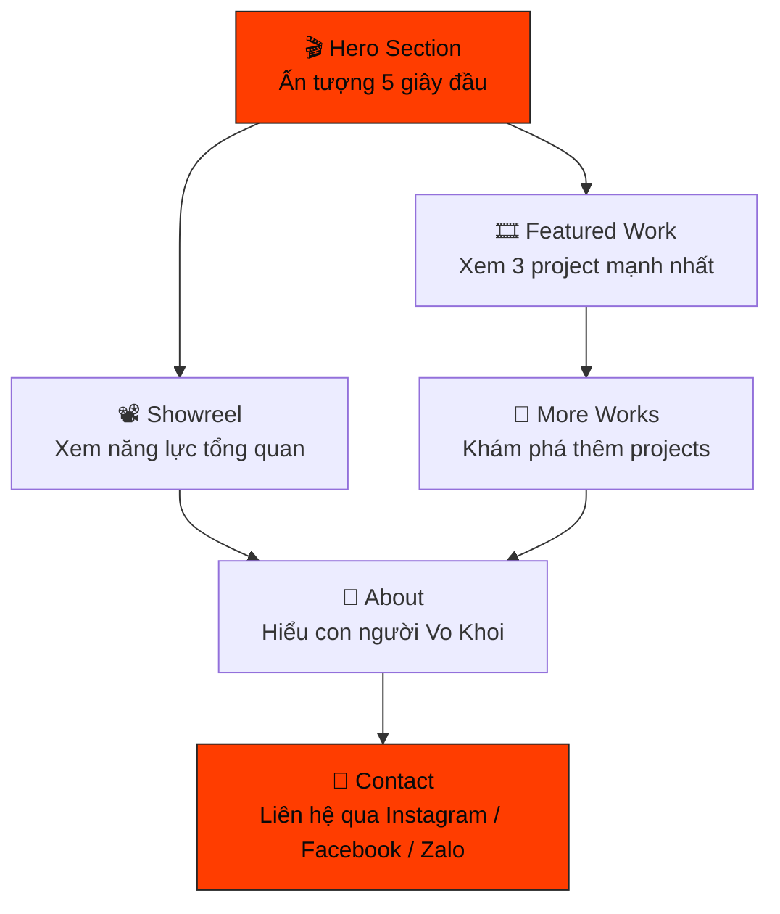

# 🎬 Vo Khoi Portfolio Website — Kế Hoạch Triển Khai Chi Tiết

## 1. Phân Tích Nghiệp Vụ (Business Analysis)

### 1.1 Tổng Quan Dự Án

| Item                        | Detail                                                                                         |
| --------------------------- | ---------------------------------------------------------------------------------------------- |
| **Tên dự án**      | Vo Khoi Portfolio Website                                                                      |
| **Chủ sở hữu**     | Võ Lê Minh Khôi                                                                             |
| **Định vị**        | Visual Storyteller & Cinematic Video Editor                                                    |
| **Loại website**     | Single Page Portfolio                                                                          |
| **Mục tiêu chính** | Xây dựng thương hiệu cá nhân → Thu hút khách hàng → Chuyển đổi thành liên hệ |

### 1.2 Phễu Chuyển Đổi (Conversion Funnel)



### 1.3 KPI Đo Lường Thành Công

| KPI                    | Mục tiêu      | Cách đo             |
| ---------------------- | --------------- | --------------------- |
| Xem ≥ 3 projects      | ≥ 60% visitors | Scroll depth tracking |
| Xem Showreel           | ≥ 40% visitors | Video play event      |
| Nhấn nút liên hệ   | ≥ 15% visitors | Click event tracking  |
| Thời gian trên trang | ≥ 2 phút      | Time on page          |

### 1.4 Persona Khách Hàng

#### Primary: Chủ quán café / Thương hiệu lifestyle nhỏ

- **Nhu cầu**: Video branding cho quán, sản phẩm
- **Pain point**: Tìm editor hiểu aesthetic, không muốn video corporate cứng nhắc
- **Quyết định dựa trên**: Portfolio visual → Cảm xúc → Giá hợp lý
- **Kênh liên hệ ưa thích**: Instagram DM, Zalo

#### Secondary: Music artists / Content creators

- **Nhu cầu**: MV, video content có chiều sâu cinematic
- **Pain point**: Tìm editor có sense về storytelling, không phải chỉ cắt ghép
- **Quyết định dựa trên**: Showreel → Style phù hợp → Portfolio projects
- **Kênh liên hệ ưa thích**: Instagram, Facebook

### 1.5 Những Thứ KHÔNG Có Trên Website

> [!CAUTION]
> Danh sách các yếu tố được **loại bỏ có chủ đích** để giữ website authentic:
>
> - ❌ Resume / CV page
> - ❌ Certificates
> - ❌ Skill percentage bars / Progress bars
> - ❌ Timeline
> - ❌ Blog
> - ❌ Testimonials (chưa có)
> - ❌ Fake metrics / Client logos
> - ❌ Complex contact form

---

## 2. Kiến Trúc Kỹ Thuật (Technical Architecture)

### 2.1 Technology Stack

| Layer                   | Technology                                      | Lý do lựa chọn                                                  |
| ----------------------- | ----------------------------------------------- | ------------------------------------------------------------------ |
| **Framework**     | Vite + React                                    | CSR, tĩnh hoàn toàn, siêu tốc máy local, mượt tuyệt đối |
| **Styling**       | Tailwind CSS v4                                 | Utility-first, nhanh, dễ responsive                               |
| **Animation**     | Framer Motion                                   | Declarative, powerful scroll animations                            |
| **Smooth Scroll** | Lenis                                           | Buttery smooth scrolling experience                                |
| **Icons**         | Lucide React                                    | Consistent, lightweight, stroke-based                              |
| **Font**          | Inter Tight + Playfair Display + JetBrains Mono | Theo design system                                                 |
| **Deployment**    | Vercel                                          | Zero-config hosting, static SPA deploy                             |
| **Video**         | TikTok Embed Iframe                             | Web nhẹ tuyệt đối, kéo tương tác thẳng về kênh TikTok              |

### 2.2 Cấu Trúc Thư Mục

```
d:\portfolio\
├── public/
│   ├── images/               # Project thumbnails + about photo
│   │   ├── projects/
│   │   │   ├── mv-1999.jpg
│   │   │   ├── vt-solo-trip.jpg
│   │   │   ├── dung-lam-chi.jpg
│   │   │   ├── coffee-storytelling.jpg
│   │   │   ├── the-eyes.jpg
│   │   │   ├── outdoor-handbrew.jpg
│   │   │   └── final-ending.jpg
│   │   └── about/
│   │       └── portrait.jpg
│   └── og-image.jpg          # Open Graph image
├── src/
│   ├── index.css             # Design tokens + global styles
│   ├── main.tsx              # Application entry point
│   ├── App.tsx               # Main component & Routing logic
│   ├── pages/
│   │   ├── Portfolio.tsx     # Single Page cho khách hàng xem
│   │   └── Admin.tsx         # /admin: CMS Backoffice cho Khôi
│   ├── components/
│   │   ├── layout/
│   │   │   ├── Navbar.tsx
│   │   │   └── Footer.tsx
│   │   ├── sections/
│   │   │   ├── Hero.tsx
│   │   │   ├── FeaturedWork.tsx
│   │   │   ├── MoreWorks.tsx
│   │   │   ├── About.tsx
│   │   │   └── Contact.tsx
│   │   ├── ui/
│   │   │   ├── Button.tsx
│   │   │   ├── ProjectCard.tsx
│   │   │   ├── ProjectGrid.tsx
│   │   │   ├── VideoPlayer.tsx
│   │   │   └── SectionHeading.tsx
│   │   └── animations/
│   │       ├── FadeInUp.tsx
│   │       ├── TextReveal.tsx
│   │       └── StaggerContainer.tsx
│   ├── data/
│   │   └── data.json         # Chứa TẤT CẢ copy, link, project cho web
│   ├── hooks/
│   │   └── useLenis.ts       # Lenis smooth scroll hook
│   └── lib/
│       └── utils.ts          # Utility functions (cn, etc.)
├── index.html                # Vite entry point
├── vite.config.ts
├── tailwind.config.ts
├── tsconfig.json
└── package.json
```

### 2.3 Design System Integration (Tailwind Config)

Toàn bộ design tokens từ **Bold Typography Design System** sẽ được map vào Tailwind config:

```
Colors:
  background:        #0A0A0A
  foreground:        #FAFAFA
  muted:             #1A1A1A
  muted-foreground:  #737373
  accent:            #FF3D00  (Vermillion)
  accent-foreground: #0A0A0A
  border:            #262626
  card:              #0F0F0F

Typography:
  font-sans:    "Inter Tight", "Inter", system-ui, sans-serif
  font-display: "Playfair Display", Georgia, serif
  font-mono:    "JetBrains Mono", "Fira Code", monospace

Scale: xs → 9xl (0.75rem → 10rem)
Tracking: tighter(-0.06em) → widest(0.2em)
Leading: none(1) → relaxed(1.75)

Radius: 0px everywhere
Border: 1px thin, 2px accent
Shadow: none
```

### 2.4 Cơ Chế Backoffice (Không Cần Backend)

Để bạn tiện cập nhật mà máy không trĩu nặng do database, ta xây dựng flow **JSON Local Caching**:

- **Trang Dashboard (/admin)**: Một trang thiết kế đơn giản riêng cho Khôi, bảo mật bẳng mật khẩu cứng nội bộ hoặc chỉ build local nội bộ, UI có form điền Text, Bio, update thumbnail và List project.
- **Quy trình CRUD**:
  1. Add/Edit thông tin thoải mái tạo trang /admin trên UI.
  2. Bấm nút **"Xuất JSON"**.
  3. Màn hình hiện ra chuỗi text JSON cấu trúc chuẩn, bạn dùng phím Copy.
  4. Mở source code local (file \`src/data/data.json\`), Paste đè vào, Save lại, sau đó commit code push lên github.
  5. Vercel tự fetch code và Deploy bản mới nhất với thời gian chưa đầy 30 giây.
- **Ưu điểm tuyệt đối**:
  - Hoàn thành requirement "dễ dàng bổ sung" bằng UI.
  - Tĩnh 100% (cực kỳ an toàn, không sợ bị hack database).
  - Zero tốn chi phí host/backend dài hạn.

---

## 3. Thiết Kế Chi Tiết Từng Section

### 3.1 Navbar

```
┌──────────────────────────────────────────────────────────┐
│  VO KHOI                    Work  About  Contact         │
│  (logo text, uppercase,     (ghost buttons,              │
│   tracking-widest)           animated underlines)        │
└──────────────────────────────────────────────────────────┘
```

- **Behavior**: Fixed top, transparent background → muted background on scroll
- **Mobile**: Logo left + hamburger menu right → Full-screen overlay menu
- **Animation**: Fade-in on load, backdrop blur on scroll
- **Z-index**: Cao nhất (z-50)

### 3.2 Hero Section

```
Desktop (Split 50/50):
┌─────────────────────────┬──────────────────────────────┐
│                         │                              │
│   VO KHOI              │    ┌──────────────────────┐   │
│   (8xl, tighter)       │    │                      │   │
│                         │    │   AUTOPLAY VIDEO     │   │
│   Visual Storyteller    │    │   (muted, loop)      │   │
│   & Cinematic Video     │    │                      │   │
│   Editor                │    │   Showreel /         │   │
│                         │    │   Hero footage       │   │
│   I create cinematic    │    │                      │   │
│   stories inspired by   │    └──────────────────────┘   │
│   coffee, travel and    │                              │
│   everyday moments.     │                              │
│                         │                              │
│   [Watch Showreel]      │                              │
│   [View Work ↓]         │                              │
│                         │                              │
└─────────────────────────┴──────────────────────────────┘

Mobile (Stacked):
┌────────────────────────┐
│  ┌──────────────────┐  │
│  │   AUTOPLAY VIDEO │  │
│  │                  │  │
│  └──────────────────┘  │
│                        │
│  VO KHOI              │
│  Visual Storyteller    │
│  ...                   │
│  [Watch Showreel]      │
│  [View Work ↓]         │
└────────────────────────┘
```

- **Animations**:
  - Title: Text reveal (clip-path hoặc translateY per character/word)
  - Subtitle: Fade-in với delay 300ms
  - Description: Fade-in với delay 500ms
  - CTAs: Fade-in với delay 700ms
  - Cover Image: Slow zoom over timeline
- **Hero Visual**: Sử dụng một ảnh Cinematic Cover tĩnh thật đẹp thay cho video tự host, bên trên hiển thị nút Play.
- **"Watch Showreel"**: Mở modal/lightbox chứa **TikTok Video Embed** của showreel, người dùng xem trực tiếp trên web nhưng tính view cho kênh TikTok.

### 3.3 Featured Work Section

```
Section Header:
┌──────────────────────────────────────────────────────────┐
│  ─── FEATURED WORK                                       │
│      (accent bar + uppercase mono label)                 │
│                                                          │
│  Selected                                                │
│  Projects                                                │
│  (4xl-6xl, tight tracking)                               │
└──────────────────────────────────────────────────────────┘

Project Cards (stacked, full-width):
┌──────────────────────────────────────────────────────────┐
│  ┌────────────────────────────────────────────────────┐  │
│  │                                                    │  │
│  │              MV 1999 THUMBNAIL                     │  │
│  │              (aspect-video, object-cover)           │  │
│  │                                                    │  │
│  │         [hover: zoom + dark overlay + CTA]         │  │
│  │                                                    │  │
│  └────────────────────────────────────────────────────┘  │
│                                                          │
│  01  ─  Music Video                                      │
│  MV 1999                                                 │
│  Short description...                                    │
│  [Watch Project →]                                       │
│                                                          │
│  ────────────────────────────────────────────────────── │
│                                                          │
│  (Repeat for VT Solo Trip, Đừng Làm Chi Nửa Vời)       │
└──────────────────────────────────────────────────────────┘
```

- **Mỗi project card**: Thumbnail + Number + Category + Title + Description + CTA
- **Hover**: Image zoom (scale-105, 500ms) + dark overlay + "Watch" CTA hiện ra
- **Animation**: Fade-up + slide-in khi scroll vào viewport (stagger 80ms)
- **Layout**: Full-width cards, stacked vertically, chia bởi border-t

### 3.4 More Works Section

```
Desktop (4-column grid):
┌──────────────────────────────────────────────────────────┐
│  ─── MORE WORKS                                          │
│                                                          │
│  ┌──────┐ ┌──────┐ ┌──────┐ ┌──────┐                   │
│  │Coffee│ │The   │ │Outdoor│ │Final │                   │
│  │Story │ │Eyes  │ │Hand  │ │Ending│                   │
│  │      │ │      │ │brew  │ │      │                   │
│  └──────┘ └──────┘ └──────┘ └──────┘                   │
│                                                          │
│  Hover: scale + overlay with title + category            │
└──────────────────────────────────────────────────────────┘
```

- **Grid**: 4 cols desktop → 2 cols tablet → 1 col mobile
- **Card**: Aspect-ratio thumbnail, minimal — hover reveals info
- **Hover**: Scale image + overlay + project title + category tag
- **Có thể mở rộng**: Để sẵn slot cho future works

### 3.5 About Section

```
Desktop (Asymmetric 5/7 split):
┌──────────────────────────────────────────────────────────┐
│                                                          │
│  ┌───────────┐    About                                  │
│  │           │                                           │
│  │ PORTRAIT  │    Tôi là Vo Khoi — a visual storyteller  │
│  │ IMAGE     │    based in Vietnam. I believe every      │
│  │           │    brand has a story worth telling through │
│  │           │    cinematic visuals...                    │
│  │           │                                           │
│  └───────────┘    Tools I Use:                           │
│                   DaVinci Resolve  ·  CapCut              │
│                                                          │
└──────────────────────────────────────────────────────────┘
```

- **Portrait**: next/image optimized, aspect-[3/4], object-cover
- **Bio**: Ngắn gọn, chân thực, không phô trương
- **Tools**: Text-only list, mono font, không có progress bars
- **Animation**: Reveal on scroll (portrait slide-in, text fade-up)

### 3.6 Contact Section

```
┌──────────────────────────────────────────────────────────┐
│                                                          │
│  (Inverted section: bg-foreground, text-background)      │
│                                                          │
│       Let's Create                                       │
│       Something                                          │
│       Together                                           │
│       (6xl-8xl, tighter tracking)                        │
│                                                          │
│       Have a project in mind?                            │
│       Let's talk about your vision.                      │
│                                                          │
│       ┌─────────────────┐                                │
│       │  Instagram  →   │  (outline button, large)       │
│       └─────────────────┘                                │
│       ┌─────────────────┐                                │
│       │  Facebook   →   │                                │
│       └─────────────────┘                                │
│       ┌─────────────────┐                                │
│       │  Zalo       →   │                                │
│       └─────────────────┘                                │
│                                                          │
└──────────────────────────────────────────────────────────┘
```

- **Design**: Inverted colors (bg trắng, text đen) → tạo contrast mạnh
- **CTA buttons**: Large outline buttons, mỗi nút → link thẳng tới profile
- **One-click**: Không form phức tạp, click = mở app/link trực tiếp
- **Animation**: Button hover → inversion (fill), press → translate-y-px

### 3.7 Footer

```
┌──────────────────────────────────────────────────────────┐
│  VO KHOI                              Instagram          │
│  Visual Storyteller                   Facebook           │
│  & Cinematic Video Editor             Zalo               │
│                                                          │
│  ──────────────────────────────────────────────────────  │
│  © 2026 Vo Khoi. All rights reserved.                    │
└──────────────────────────────────────────────────────────┘
```

- Minimal, border-t separator
- Social links với animated underlines

---

## 4. Animation & Interaction Detail

### 4.1 Animation Timeline

| Element            | Trigger           | Animation                     | Duration            | Easing                   |
| ------------------ | ----------------- | ----------------------------- | ------------------- | ------------------------ |
| Navbar             | Page load         | Fade-in                       | 300ms               | ease-out                 |
| Hero Title         | Page load         | Text reveal (clip/translateY) | 600ms               | cubic-bezier(0.25,0,0,1) |
| Hero Subtitle      | Page load + 300ms | Fade-in ↑                    | 500ms               | cubic-bezier(0.25,0,0,1) |
| Hero Description   | Page load + 500ms | Fade-in ↑                    | 500ms               | cubic-bezier(0.25,0,0,1) |
| Hero CTAs          | Page load + 700ms | Fade-in ↑                    | 500ms               | cubic-bezier(0.25,0,0,1) |
| Hero Video         | Continuous        | Slow zoom (1 → 1.05)         | 20s                 | linear, infinite         |
| Section Headers    | Scroll into view  | Fade-in ↑                    | 500ms               | cubic-bezier(0.25,0,0,1) |
| Project Cards      | Scroll into view  | Stagger fade-up               | 500ms, stagger 80ms | cubic-bezier(0.25,0,0,1) |
| Project Thumbnails | Hover             | Scale 1.05                    | 500ms               | ease                     |
| Buttons            | Hover             | Underline scale-x             | 150ms               | ease                     |
| About Portrait     | Scroll into view  | Slide-in from left            | 600ms               | cubic-bezier(0.25,0,0,1) |
| Contact Heading    | Scroll into view  | Text reveal                   | 600ms               | cubic-bezier(0.25,0,0,1) |

### 4.2 Scroll Behavior

- **Lenis** smooth scroll cho toàn bộ page
- **Navbar links**: Smooth scroll tới section tương ứng
- **Viewport trigger**: `once: true`, threshold 15%, margin -50px
- **Mobile**: Giữ smooth scroll nhưng giảm animation intensity

---

## 5. TikTok Embed Lightbox

> [!IMPORTANT]
> Khi user nhấn "Watch Showreel" hoặc "Watch Project":
>
> - Mở modal/lightbox overlay full-screen.
> - Bên trong hiển thị UI **Preview TikTok Video**.
> - Video liên kết trực tiếp với server TikTok bằng blockquote / iframe của TikTok (\`https://www.tiktok.com/embed/...\`).
> - Click backdrop hoặc X button để đóng.
> - **Lợi ích kép**: Người dùng xem video trọn vẹn, cấu trúc web siêu nhẹ vì không load file cục bộ, và lượt xem / tương tác được tính nguyên cho kênh TikTok của bạn.

---

## 6. SEO & Performance

### 6.1 SEO Plan

| Element                   | Value                                                                                                               |
| ------------------------- | ------------------------------------------------------------------------------------------------------------------- |
| **Title**           | `Vo Khoi — Visual Storyteller & Cinematic Video Editor`                                                          |
| **Description**     | `I create cinematic stories inspired by coffee, travel and everyday moments. Video editing portfolio by Vo Khoi.` |
| **OG Image**        | Custom designed 1200x630 image                                                                                      |
| **OG Type**         | `website`                                                                                                         |
| **Canonical URL**   | Production domain                                                                                                   |
| **Structured Data** | Person schema (name, jobTitle, url)                                                                                 |
| **Semantic HTML**   | `<header>`, `<main>`, `<section>`, `<footer>`, `<nav>`                                                    |

### 6.2 Performance Targets

| Metric                   | Target  |
| ------------------------ | ------- |
| Lighthouse Performance   | > 90    |
| First Contentful Paint   | < 1.5s  |
| Largest Contentful Paint | < 2.5s  |
| Total Blocking Time      | < 200ms |
| Cumulative Layout Shift  | < 0.1   |
| Full page load           | < 3s    |

### 6.3 Optimization Strategies

- **Images**: Plugin `vite-plugin-image-optimizer` và dùng thẻ `<picture>` / thuộc tính `loading="lazy"`
- **Videos/Embeds**: Script TikTok Embed chỉ load khi user click (Lazy initialization). Các modal iframe sử dụng `loading="lazy"`. Website sẽ có bundle size siêu việt do loại bỏ hoàn toàn module xử lý video player cục bộ.
- **Fonts**: Self-hosted fonts, preload ở `index.html`, css dùng `font-display: swap`
- **Code**: Code splitting trong Vite (`React.lazy` cho modal / admin page)
- **Data**: Tách config ra file JSON tĩnh cho phép read siêu nhanh không parse nặng

---

## 7. Responsive Breakpoints

| Breakpoint        | Width          | Key Changes                                           |
| ----------------- | -------------- | ----------------------------------------------------- |
| **Mobile**  | < 640px        | Stack all, text-4xl hero, 1-col grids, hamburger menu |
| **Tablet**  | 640px - 1024px | 2-col grids, text-5xl hero, side-by-side about        |
| **Desktop** | > 1024px       | 4-col more works, text-7xl-8xl hero, full navbar      |

---

## 8. User Review Required

> [!IMPORTANT]
> **Cần xác nhận từ bạn trước khi code:**

### 8.1 Về Content & Media

1. **TikTok Link cho Showreel**: Bạn dán URL bài post TikTok của video Showreel vào đây nhé.
2. **TikTok Links cho Projects**: Với mỗi project, bạn chuẩn bị URL TikTok tương ứng để tôi config embed:
   - MV 1999 → ?
   - VT Solo Trip → ?
   - Đừng Làm Chi Nửa Vời → ?
   - Coffee Storytelling → ?
   - The Eyes → ?
   - Outdoor Handbrew → ?
   - Final Ending → ?
3. **Ảnh Hero & Thumbnail**: Vẫn cần một số ảnh tĩnh làm bìa dự án (tổng 7 thumbnail) và 1 ảnh cover tĩnh Cinematic thay cho Hero video.
4. **Social links**: Instagram URL, Facebook URL, Zalo link/số?

### 8.2 Về Technical Decisions

6. **Deployment domain** — Bạn đã có domain riêng chưa hay dùng `.vercel.app`?
7. **Tailwind version** — PRD ghi Tailwind CSS. Tôi sẽ dùng **Tailwind v4** (mới nhất). OK không?
8. **Bio text** — Bạn muốn viết bio/giới thiệu bản thân nội dung gì? Hay để tôi draft giúp?

### 8.3 Về Design

9. **Accent color** — Design system dùng Vermillion (#FF3D00). Bạn thích màu này hay muốn đổi?
10. **Dark mode only** — Website chỉ có dark mode (theo design system). OK không?

---

## 9. Kế Hoạch Thực Hiện (Execution Plan)

### Phase 1: Foundation (Setup + Design System)

1. Init Vite project với React và TypeScript (SWC compiler)
2. Cài dependencies (Tailwind, Framer Motion, Lenis, Lucide)
3. Cấu hình fonts (Inter Tight, Playfair Display, JetBrains Mono)
4. Setup design tokens trong `globals.css` + `tailwind.config.ts`
5. Tạo base UI components (Button, SectionHeading)
6. Tạo animation components (FadeInUp, TextReveal, StaggerContainer)
7. Setup Lenis smooth scroll

### Phase 2: Core Sections

8. Build Navbar (fixed, scroll behavior, mobile menu)
9. Build Hero Section (split layout, video, text reveal)
10. Build Featured Work Section (project cards, hover effects)
11. Build More Works Section (grid, hover overlays)
12. Build About Section (portrait, bio, tools)
13. Build Contact Section (inverted, large CTAs)
14. Build Footer

### Phase 3: Interactions & Polish

15. Video lightbox/modal component
16. Smooth scroll navigation
17. Page load animation sequence
18. Scroll-triggered animations
19. Màn hình Dashboard /admin (Forms + logic xuất text json)
20. Mobile navigation overlay

### Phase 4: Optimization & Deploy

20. Image/Video optimization
21. SEO metadata + Open Graph
22. Lighthouse audit + fixes
23. Responsive testing
24. Deploy to Vercel

---

## 10. Verification Plan

### Automated Tests

- `npm run build` — đảm bảo build thành công, không lỗi TypeScript
- Lighthouse CLI audit cho performance, accessibility, SEO, best practices
- Responsive check tại 375px, 768px, 1024px, 1440px

### Manual Verification

- Browser test: mở website, kiểm tra từng section
- Test tất cả hover effects, animations
- Test video autoplay trên mobile (muted)
- Test smooth scroll navigation
- Test modal video player
- Test social links mở đúng trang
- Test keyboard navigation (Tab, ESC)
- Test trên Chrome, Firefox, Safari (nếu có)
